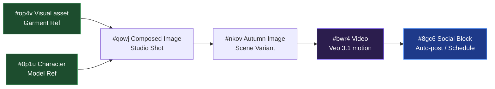

<p align="center">
  
</p>

<p align="center">
  <a href="#license"></a>
  
  
  
  
  
  
  
  
  
  
  
  
</p>

---

<p align="center">
  <b>Flowboard IDM: Không gian làm việc Infinite-Canvas tối ưu cho quy trình sáng tạo Video AI và tự động hóa xuất bản đa kênh.</b><br/>
  Thiết kế nhân vật, trang phục, bối cảnh và kịch bản video dưới dạng một đồ thị tương tác (Directed Graph). Tích hợp tác vụ tạo ảnh/video chất lượng cao qua Google Flow (Veo 3.1 / GEM_PIX_2) và tự động lên lịch đăng bài trực tiếp lên các nền tảng mạng xã hội lớn.
</p>

---

## 🚀 Tính năng nổi bật

### 🎨 Sáng tạo nội dung dạng Đồ thị (Graph-based Workflow)
* **Khối tham chiếu (Reference Nodes)**: Tải lên hình ảnh khuôn mặt nhân vật (`Character`) hoặc sản phẩm/áo quần (`Visual Asset`) một lần duy nhất. Đảm bảo tính đồng nhất tối đa của nhân vật trên mọi khung hình.
* **Khối hình ảnh (Image Nodes)**: Kết hợp các tài nguyên thượng nguồn để sinh ra hình ảnh với bối cảnh mới mà không bị lệch đặc trưng nhân vật.
* **Khối cốt truyện (Storyboard Nodes)**: Tạo chuỗi phân cảnh từ 1-8 hình ảnh liên tục với cơ chế kiểm soát logic BFS, tự động tạo lại các phân cảnh lỗi.
* **Khối video (Video Nodes)**: Kích hoạt mô hình **Veo 3.1 i2v** tạo chuyển động điện ảnh từ ảnh nguồn và prompt hành động.

### 🤖 Tác vụ AI Agent tự động hóa chuyên sâu
* **Tự động viết Prompt (Auto-Prompt Synth)**: AI tự động phân tích các hình ảnh tham chiếu thượng nguồn, hiểu bối cảnh và tự động viết các câu lệnh chuyển động (motion prompts) tối ưu nhất mà không cần bạn phải gõ thủ công.
* **Đồng bộ giọng đọc & Khung hình (Dynamic Speed Stretching)**: Tự động phân tích độ dài giọng đọc AI thuyết minh (Edge TTS) và tự động kéo giãn tốc độ video (slow motion) hoặc dừng hình ở cuối (Hybrid Freeze Frame) để âm thanh và hình ảnh khớp nhau 100% đến từng giây.

### 📅 Lên lịch & Đăng bài tự động (Social Blocks)
* Kết nối bất kỳ khối Ảnh / Video nào tới khối **Social Block**.
* Hỗ trợ viết hoặc nhấn **🤖 Generate AI** để AI tự động soạn thảo Caption chuyên nghiệp kèm Emoji dựa vào nội dung hình ảnh/video.
* **Đăng ngay (Direct Posting)** hoặc **Lên lịch đăng bài (Schedule)** theo ngày/giờ. Trình lập lịch ngầm của Backend tự động xuất bản bài viết lên Facebook Page ngay khi đến giờ hẹn.

---

## 📸 Demo hoạt động

<p align="center">
  <a href="docs/assets/flowboard-intro.mp4">
    
  </a><br/>
  <sub>Quy trình khép kín: Tải hình ảnh mẫu ➔ Tạo cảnh ➔ Tạo video Veo ➔ Đăng bài viết. Bấm vào ảnh để xem video chất lượng cao MP4.</sub>
</p>

---

## 🛠️ Luồng hoạt động của hệ thống



> [!IMPORTANT]
> **Yêu cầu phần cứng & tài khoản bắt buộc:**
> 1. **Tài khoản Google Flow (Pro hoặc Ultra)**: Do mô hình Veo 3.1 i2v + GEM_PIX_2 yêu cầu gói trả phí trên [labs.google/fx](https://labs.google/fx/tools/flow).
> 2. **Chrome Extension (bắt buộc cài đặt)**: Để làm cổng trung gian proxy, chuyển tiếp các yêu cầu sinh ảnh/video kèm reCAPTCHA token qua phiên đăng nhập Flow của trình duyệt Chrome một cách an toàn.
> 3. **AI CLI trên PATH**: Flowboard hỗ trợ cài đặt các công cụ AI CLI để chạy tính năng tự động sinh prompt/kịch bản:
>    - **Claude Code** (Khuyên dùng) — `@anthropic-ai/claude-code`
>    - **Gemini CLI** — `@google/gemini-cli`

---

## 🏛️ Kiến trúc hệ thống

```
┌──────────────────────┐    ┌────────────────────┐    ┌──────────────────────┐
│  Chrome MV3 ext      │◄───┤  FastAPI agent     ├───►│  SQLite (storage/)   │
│  - content script    │ WS │  127.0.0.1:8101    │    │  Bảng Board, Nodes,  │
│  - injected MAIN     │ ws │  + hàng đợi worker │    │  Cạnh nối, Yêu cầu,  │
│  - Captcha bridge    │9223│  + WS Server :9223 │    │  SocialBlockPost...  │
└──────────────────────┘    └─────────┬──────────┘    └──────────────────────┘
                                      │
                                      ▼
                            ┌────────────────────┐
                            │  React + Vite      │
                            │  ReactFlow canvas  │
                            │  127.0.0.1:1234    │
                            └────────────────────┘
```

---

## ⚙️ Cấu hình Tích hợp Mạng xã hội

Để kích hoạt tính năng tự động đăng bài và lên lịch đăng bài trong các khối **Social Block**, bạn cần cấu hình các thông tin xác thực trong file môi trường `.env` của Backend.

### 📱 Tích hợp Fanpage Facebook
Thêm thông tin trang và Token vĩnh viễn vào file `agent/.env`:

```env
# Facebook Page Credentials
FB_PAGE__ID=nhap_id_fanpage_cua_ban
FB_PAGE__ACCESS_TOKEN=nhap_token_truy_cap_permanent_cua_trang
```

#### Hướng dẫn lấy các thông tin này:
1. **Lấy Page ID**: Truy cập Fanpage ➔ Chọn **Giới thiệu** (About) ➔ **Tính minh bạch của trang** (Page transparency) ➔ Sao chép **Page ID**.
2. **Lấy Permanent Access Token (Token vĩnh viễn)**:
   - Truy cập trang [Facebook Developers](https://developers.facebook.com/) và tạo một App Doanh nghiệp.
   - Mở công cụ **Trình khám phá API đồ thị** (Graph API Explorer).
   - Chọn App vừa tạo, tạo **User Token** và cấp các quyền: `pages_show_list`, `pages_read_engagement`, `pages_manage_posts`, `publish_video`.
   - Bấm **Generate Access Token** và chọn Trang của bạn dưới mục "Page Token", sao chép Token được tạo ra.
   - **Đổi sang Token vĩnh viễn**: Sử dụng công cụ **Access Token Debugger** của Facebook để gia hạn mã này thành mã vĩnh viễn không hết hạn.

---

## 🚀 Hướng dẫn cài đặt nhanh (Quickstart)

### Yêu cầu hệ thống
* **Python 3.11+** và **Node.js 20+**
* Trình duyệt **Google Chrome** (Đã bật Developer Mode)

### Các bước khởi chạy dự án

Dự án đi kèm với công cụ `Makefile` để cài đặt và chạy nhanh chỉ với 3 lệnh:

1. **Cài đặt thư viện & môi trường:**
   ```bash
   make install
   ```
2. **Khởi chạy Backend Agent (FastAPI - Port 8101):**
   ```bash
   make agent
   ```
3. **Khởi chạy Frontend Dev Server (React/Vite - Port 1234):**
   ```bash
   make frontend
   ```

*Sau khi chạy 3 bước trên:*
1. Mở Chrome, truy cập `chrome://extensions/`, bật chế độ **Developer Mode**, chọn **Load unpacked** và dẫn tới thư mục `extension/` trong dự án.
2. Đăng nhập vào trang dịch vụ Google Flow tại: [labs.google/fx/tools/flow](https://labs.google/fx/tools/flow).
3. Truy cập địa chỉ `http://localhost:1234` trên Chrome để bắt đầu thiết kế luồng trên Canvas.

Để chạy bộ kiểm thử tự động của Backend (bao gồm 333 bài test):
```bash
cd agent && .venv/bin/python -m pytest -q
```

---

## 📜 Technical Skills & Documentation

* **[HUONG_DAN_TAO_PHIM.md](file:///c:/Users/Admin/Documents/Google-flowboard-IDM/HUONG_DAN_TAO_PHIM.md)**: Cẩm nang chi tiết hướng dẫn dựng kịch bản, lời thoại, lồng tiếng thuyết minh và đồng bộ video.
* **[OAUTH_SETUP_GUIDE.md](file:///c:/Users/Admin/Documents/Google-flowboard-IDM/OAUTH_SETUP_GUIDE.md)**: Hướng dẫn cấu hình Firebase Auth, đăng nhập bằng tài khoản Google, và quản lý giới hạn thiết bị đăng nhập đồng thời.
* **[UPGRADE_ROADMAP.md](file:///c:/Users/Admin/Documents/Google-flowboard-IDM/UPGRADE_ROADMAP.md)**: Lộ trình nâng cấp các tính năng bổ sung về AI Models và hạ tầng.
* **[skill.md](file:///c:/Users/Admin/Documents/Google-flowboard-IDM/skill.md)**: Đặc tả kiến thức nghiệp vụ kỹ thuật cho các AI sub-agent cộng tác.

---

## 📄 Giấy phép

Phát hành dưới giấy phép **MIT License**. Bản quyền thuộc về đội ngũ phát triển Flowboard.
