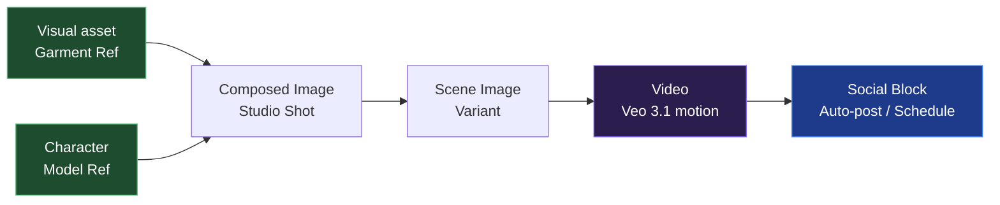

<p align="center">
  <a href="#-giấy-phép"></a>
  
  
  
  
  
  
  
  
  
</p>

---

<p align="center">
  <b>Flowboard IDM: Không gian làm việc Infinite-Canvas tối ưu cho quy trình sáng tạo Video AI và tự động hóa xuất bản đa kênh.</b><br/>
  Thiết kế nhân vật, trang phục, bối cảnh và kịch bản video dưới dạng một đồ thị tương tác (Directed Graph). Tích hợp tạo ảnh/video chất lượng cao qua Google Flow (Veo 3.1 / GEM_PIX_2) và tự động lên lịch đăng bài lên mạng xã hội.
</p>

---

## 📑 Mục lục

1. [Tính năng nổi bật](#-tính-năng-nổi-bật)
2. [Kiến trúc hệ thống](#-kiến-trúc-hệ-thống)
3. [Cấu trúc thư mục](#-cấu-trúc-thư-mục)
4. [Yêu cầu hệ thống](#-yêu-cầu-hệ-thống)
5. [Cài đặt & Khởi chạy](#-cài-đặt--khởi-chạy)
6. [Cấu hình môi trường (.env)](#-cấu-hình-môi-trường-env)
7. [Hướng dẫn tạo phim (5 giai đoạn)](#-hướng-dẫn-tạo-phim-5-giai-đoạn)
8. [Tích hợp & lấy OAuth mạng xã hội](#-tích-hợp--lấy-oauth-mạng-xã-hội)
9. [Kiểm thử (Testing)](#-kiểm-thử-testing)
10. [Xử lý sự cố (Troubleshooting)](#-xử-lý-sự-cố-troubleshooting)
11. [Tài liệu liên quan](#-tài-liệu-liên-quan)
12. [Giấy phép](#-giấy-phép)

---

## 🚀 Tính năng nổi bật

### 🎨 Sáng tạo nội dung dạng Đồ thị (Graph-based Workflow)
* **Khối tham chiếu (Reference Nodes)**: Tải lên ảnh khuôn mặt nhân vật (`Character`) hoặc sản phẩm/áo quần (`Visual Asset`) một lần duy nhất → đồng nhất nhân vật trên mọi khung hình.
* **Khối hình ảnh (Image Nodes)**: Kết hợp các tài nguyên thượng nguồn để sinh ảnh bối cảnh mới mà không lệch đặc trưng nhân vật.
* **Khối cốt truyện (Storyboard Nodes)**: Tạo chuỗi 1–8 phân cảnh liên tục với cơ chế kiểm soát BFS, tự động tạo lại cảnh lỗi.
* **Khối video (Video Nodes)**: Kích hoạt **Veo 3.1 i2v** tạo chuyển động điện ảnh từ ảnh nguồn + prompt hành động.

### 🤖 Tác vụ AI Agent tự động hóa
* **Auto-Prompt Synth**: AI tự phân tích ảnh tham chiếu, hiểu bối cảnh và tự viết motion prompts tối ưu.
* **Dynamic Speed Stretching**: Tự phân tích độ dài giọng đọc (Edge TTS) rồi kéo giãn tốc độ video (slow motion) hoặc dừng hình cuối (Hybrid Freeze Frame) để âm thanh & hình ảnh khớp 100%.

### 📅 Lên lịch & Đăng bài tự động (Social Blocks)
* Nối khối Ảnh/Video tới khối **Social Block**.
* Nhấn **🤖 Generate AI** để AI tự soạn Caption kèm Emoji theo nội dung.
* **Đăng ngay** hoặc **Lên lịch**; trình lập lịch nền của Backend tự xuất bản lên Facebook Page đúng giờ hẹn.

---

## 🏛️ Kiến trúc hệ thống

Hệ thống gồm **3 tiến trình chạy song song**, chỉ giao tiếp qua loopback (127.0.0.1):

```
┌──────────────────────┐    ┌────────────────────┐    ┌──────────────────────┐
│  Chrome MV3 ext      │◄───┤  FastAPI agent     ├───►│  SQLite (storage/)   │
│  - content script    │ WS │  127.0.0.1:8101    │    │  Board, Nodes,       │
│  - injected MAIN     │ ws │  + hàng đợi worker │    │  Edges, Requests,    │
│  - Captcha bridge    │9223│  + WS Server :9223 │    │  SocialBlockPost...  │
└──────────────────────┘    └─────────┬──────────┘    └──────────────────────┘
                                      │ HTTP/WS
                                      ▼
                            ┌────────────────────┐
                            │  React + Vite      │
                            │  ReactFlow canvas  │
                            │  127.0.0.1:1234    │
                            └────────────────────┘
```

**Luồng tạo nội dung khép kín:**



**Vai trò từng thành phần:**

| Thành phần | Thư mục | Công nghệ | Cổng | Vai trò |
|---|---|---|---|---|
| Backend (agent) | `agent/` | Python 3.11 + FastAPI + SQLModel | 8101 (HTTP), 9223 (WS) | API, hàng đợi tạo media, scheduler, DB |
| Frontend | `frontend/` | React 18 + TS + Vite + React Flow + Zustand | 1234 | Giao diện canvas kéo-thả |
| Extension | `extension/` | Chrome MV3 | — | Cầu nối proxy tới Google Flow |

**Cơ chế tạo media:** Frontend tạo request → Backend worker đẩy qua WS tới Extension → Extension gọi Google Flow trong trình duyệt → trả kết quả về `/api/ext/callback` (bảo vệ bằng HMAC `X-Callback-Secret`) → `flow_client` khớp request và lưu media.

---

## 📂 Cấu trúc thư mục

```
Google-flowboard-IDM/
├── agent/                          # BACKEND (Python / FastAPI)
│   ├── flowboard/
│   │   ├── main.py                 # App factory + 4 task nền (worker, ws, schedulers)
│   │   ├── config.py               # Cấu hình từ biến môi trường
│   │   ├── short_id.py
│   │   ├── db/                     # SQLModel models + session (SQLite)
│   │   ├── routes/                 # API endpoints (1 module / domain)
│   │   │   ├── boards / nodes / edges      # Canvas graph
│   │   │   ├── media / upload / references / vision
│   │   │   ├── prompt / llm / chat / plans # AI
│   │   │   ├── video_assembly / ffmpeg_assembly   # Dựng video
│   │   │   ├── social / social_block / oauth       # Đăng bài
│   │   │   └── auth / firebase_auth / requests / activity
│   │   ├── services/               # Logic nghiệp vụ
│   │   │   ├── flow_client.py / flow_sdk.py   # Google Flow
│   │   │   ├── llm/                # Claude / Gemini / OpenAI (qua CLI) + secrets
│   │   │   ├── tts.py / vision.py / face_swapper.py
│   │   │   ├── prompt_synth.py / planner.py / pipeline_executor.py
│   │   │   ├── platform_poster.py / ws_server.py
│   │   │   └── activity.py / events.py / media*.py
│   │   └── worker/                 # processor (hàng đợi) + social_scheduler
│   ├── tests/                      # ~333 bài test (pytest)
│   ├── requirements.txt            # Dependencies (pip)
│   └── pyproject.toml
├── frontend/                       # FRONTEND (React + Vite)
│   ├── src/
│   │   ├── App.tsx / main.tsx
│   │   ├── canvas/                 # Board, NodeCard, AddNodePalette, VariantEdge
│   │   ├── components/             # Dialog, panel, activity, settings...
│   │   ├── store/                  # Zustand: board, chat, generation, pipeline...
│   │   ├── api/                    # client.ts (gọi backend), github, autoBrief
│   │   ├── lib/ / constants/ / styles.css
│   ├── package.json / vite.config.ts / tsconfig.json
├── extension/                      # CHROME EXTENSION (MV3)
│   ├── manifest.json
│   ├── background.js / content.js / injected.js
│   ├── popup.html / popup.js / rules.json
├── docs/                           # Tài liệu, ảnh demo, design, migrations
├── run.py                          # Điểm chạy gộp (cho bản EXE đóng gói)
├── install-all.bat / start-all.bat # Script Windows
├── Makefile                        # Lệnh cho macOS/Linux
├── .env.example                    # Mẫu cấu hình môi trường
├── README.md                       # ← file này
├── CLAUDE.md / AGENTS.md           # Onboarding cho AI agent
└── HUONG_DAN_TAO_PHIM.md / OAUTH_SETUP_GUIDE.md / UPGRADE_ROADMAP.md
```

---

## 🖥️ Yêu cầu hệ thống

| Thành phần | Yêu cầu |
|---|---|
| **Python** | 3.11+ (tối thiểu 3.10) |
| **Node.js** | 20+ |
| **ffmpeg** | Bắt buộc, phải có trong PATH (dùng để ghép video + chèn tiếng) |
| **Google Chrome** | Đã bật Developer Mode |
| **Tài khoản Google Flow** | **Pro hoặc Ultra** (Veo 3.1 i2v + GEM_PIX_2 yêu cầu gói trả phí tại [labs.google/fx](https://labs.google/fx/tools/flow)) |
| **AI CLI (tùy chọn)** | `@anthropic-ai/claude-code` (khuyên dùng) hoặc `@google/gemini-cli` để bật auto-prompt |

> **Cài ffmpeg trên Windows:** `winget install Gyan.FFmpeg` rồi mở lại terminal. Kiểm tra: `ffmpeg -version`.

---

## ⚙️ Cài đặt & Khởi chạy

### 🪟 Windows (khuyên dùng)

```bat
:: 1. Cài đặt thư viện Backend + Frontend
install-all.bat

:: 2. Khởi chạy Backend + Frontend
start-all.bat        :: chọn [1] chạy ẩn hoặc [2] hiện cửa sổ CMD
```

### 🍎 macOS / Linux

```bash
make install         # cài đặt dependencies
make agent           # chạy backend  (cổng 8101)
make frontend        # chạy frontend (cổng 1234)
```

### Chạy thủ công từng phần

```bash
# Backend
cd agent && python -m uvicorn flowboard.main:app --host 127.0.0.1 --port 8101 --reload

# Frontend
cd frontend && npm run dev
```

### 🧩 Cài đặt Chrome Extension (bắt buộc)

1. Mở Chrome → `chrome://extensions/` → bật **Developer Mode**.
2. Chọn **Load unpacked** → trỏ tới thư mục `extension/` trong dự án.
3. Đăng nhập Google Flow tại [labs.google/fx/tools/flow](https://labs.google/fx/tools/flow).
4. Mở `http://localhost:1234` để bắt đầu thiết kế trên Canvas.

---

## 🔐 Cấu hình môi trường (.env)

Copy `.env.example` thành `.env` và đặt trong thư mục `agent/` (khi chạy bằng `start-all.bat`) hoặc thư mục gốc (khi chạy bằng `run.py`).

```bash
cp .env.example agent/.env
```

### Biến cốt lõi

| Biến | Mặc định | Ý nghĩa |
|---|---|---|
| `FLOWBOARD_HTTP_PORT` | `8101` | Cổng Backend |
| `FLOWBOARD_WS_HOST` | `127.0.0.1` | **Phải là loopback** — WS extension không xác thực, không được mở ra mạng |
| `FLOWBOARD_EXT_WS_PORT` | `9223` | Cổng WS nối extension |
| `FLOWBOARD_STORAGE` | `storage` | Thư mục lưu DB + media |
| `FLOWBOARD_DB` | `storage/flowboard.db` | Đường dẫn SQLite (**dùng biến này, KHÔNG dùng `DATABASE_URL`**) |
| `FLOWBOARD_PLANNER_MODEL` | `claude-sonnet-4-6` | Model AI lập kế hoạch |
| `FLOWBOARD_PLANNER_BACKEND` | `auto` | `auto` / `cli` / `mock` |
| `ALLOWED_EMAILS` / `ALLOWED_DOMAINS` | (rỗng) | Giới hạn email/domain đăng nhập (rỗng = cho tất cả) |
| `FIREBASE_SERVICE_ACCOUNT` | `firebase-service-account.json` | Đường dẫn key Firebase Admin (thiếu → chạy mock auth) |
| `LOG_LEVEL` | `INFO` | Mức log |

> **Lưu ý AI:** Backend gọi Claude/Gemini/OpenAI qua **CLI**, không cần API key trong `.env`. Key được lưu qua secrets store trong app (`FLOWBOARD_SECRETS_PATH`).

### Biến đăng Facebook Page (Social Block)

```env
# CHÚ Ý: dùng 2 dấu gạch dưới "__"
FB_PAGE__ID=your_facebook_page_id
FB_PAGE__ACCESS_TOKEN=your_facebook_page_permanent_token
```

### Biến OAuth mạng xã hội (TikTok / Facebook / YouTube / Instagram)

Xem mục [Tích hợp & lấy OAuth](#-tích-hợp--lấy-oauth-mạng-xã-hội) bên dưới và file `.env.example` để biết đầy đủ.

---

## 🎬 Hướng dẫn tạo phim (5 giai đoạn)

### Sơ đồ đi dây trên Canvas

**Luồng cơ bản** (AI tự nối sau khi bạn nhập cốt truyện):
```
[▣ Image] (Ảnh gốc) ─► [▶ Video] (Clip) ─► [🎬 Video Assembly] (Ghép phim)
```

**Luồng nâng cao** (thêm phong cách + nhân vật đồng nhất):
```
[🎨 Style Preset] ─────────┐
                          ├─► [▣ Image] ─► [▶ Video] ─► [🎬 Video Assembly]
[◎ Character]  ───────────┘
```
> ⚠️ **Quy tắc:** Thẻ Phong cách (🎨) và Nhân vật (◎) luôn nối vào thẻ **Image (▣)**, KHÔNG nối vào Video. Thẻ Video sẽ tự kế thừa từ ảnh mở đầu.

### Các bước

1. **GĐ1 — Chuẩn bị Canvas:** Tạo thẻ **🎬 Video Assembly** + **📝 Story Script** từ thanh công cụ, nối Story Script → Video Assembly.
2. **GĐ2 — AI tự vẽ kịch bản:** Gõ cốt truyện (tiếng Việt) vào Story Script → nhấn **✦ Tự động phân cảnh**. AI tự sinh 3–5 cặp thẻ Image + Video, tự điền prompt, viết thuyết minh, nối dây sẵn.
3. **GĐ3 — Nâng cao (tùy chọn):** Thêm **🎨 Style Preset** (6 phong cách: Hollywood, Ghibli...) và **◎ Character** (tải ảnh khuôn mặt), nối vào các thẻ Image.
4. **GĐ4 — Tạo hàng loạt:** Double-click thẻ **🎬 Video Assembly** → nhấn **⚡ Tạo hàng loạt [N] clip**. Theo dõi trạng thái `Queued → Running → Done`.
5. **GĐ5 — Ghép phim hoàn chỉnh:** Nhấn **🎵 Nhập nhạc nền** → sắp xếp thứ tự cảnh → **Bắt đầu ghép nối 🎬**. Hệ thống tự ghép clip, đọc thuyết minh AI tiếng Việt, trộn nhạc nền (tự giảm 20% âm lượng khi có thuyết minh).

> 💡 **Mẹo:** Cốt truyện càng giàu hình ảnh → AI vẽ càng đẹp. Thuyết minh mỗi cảnh nên ngắn (1–2 câu) để khớp khung hình.

Chi tiết đầy đủ: xem [HUONG_DAN_TAO_PHIM.md](HUONG_DAN_TAO_PHIM.md).

---

## 📱 Tích hợp & lấy OAuth mạng xã hội

Tất cả Redirect URI có dạng: `http://localhost:8101/api/social/oauth/<platform>/callback`

| Nền tảng | Lấy credentials tại | Biến cần điền |
|---|---|---|
| **TikTok** | [developers.tiktok.com](https://developers.tiktok.com/) | `TIKTOK_CLIENT_ID`, `TIKTOK_CLIENT_SECRET`, `TIKTOK_REDIRECT_URI` |
| **Facebook** | [developers.facebook.com](https://developers.facebook.com/) | `FACEBOOK_CLIENT_ID`, `FACEBOOK_CLIENT_SECRET`, `FACEBOOK_REDIRECT_URI` + `FB_PAGE__ID`, `FB_PAGE__ACCESS_TOKEN` |
| **YouTube** | [console.cloud.google.com](https://console.cloud.google.com/) (bật YouTube Data API v3) | `YOUTUBE_CLIENT_ID`, `YOUTUBE_CLIENT_SECRET`, `YOUTUBE_REDIRECT_URI` |
| **Instagram** | Dùng Facebook Developer (cần Instagram Business Account) | `INSTAGRAM_CLIENT_ID`, `INSTAGRAM_CLIENT_SECRET`, `INSTAGRAM_REDIRECT_URI` |

**Lấy Facebook Page Token (cho auto-post):**
1. Graph API Explorer → cấp quyền `pages_show_list`, `pages_read_engagement`, `pages_manage_posts`, `publish_video`.
2. Chạy `GET /me/accounts` để lấy Page ID + Page access token.
3. Dùng **Access Token Debugger** để đổi thành **token vĩnh viễn** → điền vào `FB_PAGE__ACCESS_TOKEN`.

> ⚠️ Code dùng `FB_PAGE__ID` / `FB_PAGE__ACCESS_TOKEN` (**hai** gạch dưới). Hướng dẫn chi tiết từng bước: xem [OAUTH_SETUP_GUIDE.md](OAUTH_SETUP_GUIDE.md).

---

## 🧪 Kiểm thử (Testing)

```bash
# Windows
cd agent && .venv\Scripts\python -m pytest -q

# macOS / Linux
cd agent && .venv/bin/python -m pytest -q
```

```bash
# Kiểm tra TypeScript frontend
cd frontend && npm run lint
```

---

## 🆘 Xử lý sự cố (Troubleshooting)

| Triệu chứng | Nguyên nhân & cách xử lý |
|---|---|
| Backend crash khi khởi động, lỗi `No module named firebase_admin` | Chưa cài dep → chạy lại `install-all.bat` (đã có `firebase-admin` trong requirements). |
| Ghép/xuất video lỗi, log nhắc `ffmpeg` | Chưa cài ffmpeg hoặc chưa có trong PATH → `winget install Gyan.FFmpeg`. |
| Đổi `.env` mà không có tác dụng | Đặt sai chỗ: dùng `agent/.env` khi chạy `start-all.bat`. Và dùng `FLOWBOARD_DB` chứ không phải `DATABASE_URL`. |
| Không tạo được ảnh/video | Chưa cài/đăng nhập Extension, hoặc tài khoản Google Flow không phải Pro/Ultra. |
| Đăng Facebook không chạy | Sai tên biến — phải là `FB_PAGE__ID` / `FB_PAGE__ACCESS_TOKEN` (2 gạch dưới), token phải là loại vĩnh viễn. |
| `RuntimeError: FLOWBOARD_WS_HOST must be loopback` | Bạn đã đặt `FLOWBOARD_WS_HOST` ra ngoài loopback — để `127.0.0.1`. |
| Đăng nhập Google bị từ chối | Email không nằm trong `ALLOWED_EMAILS`/`ALLOWED_DOMAINS`, hoặc thiếu file Firebase service account. |

---

## 📚 Tài liệu liên quan

* **[HUONG_DAN_TAO_PHIM.md](HUONG_DAN_TAO_PHIM.md)** — Cẩm nang đầy đủ dựng kịch bản, lồng tiếng, đồng bộ video.
* **[OAUTH_SETUP_GUIDE.md](OAUTH_SETUP_GUIDE.md)** — Hướng dẫn lấy OAuth từng nền tảng + Firebase Auth.
* **[UPGRADE_ROADMAP.md](UPGRADE_ROADMAP.md)** — Lộ trình nâng cấp AI Models & hạ tầng.
* **[CLAUDE.md](CLAUDE.md)** / **[AGENTS.md](AGENTS.md)** — Onboarding kỹ thuật cho AI sub-agent.
* **[skill.md](skill.md)** — Đặc tả nghiệp vụ kỹ thuật.

---

## 📄 Giấy phép

Phát hành dưới giấy phép **MIT License**. Bản quyền thuộc về đội ngũ phát triển Flowboard.
